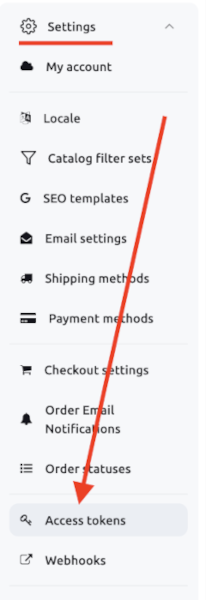
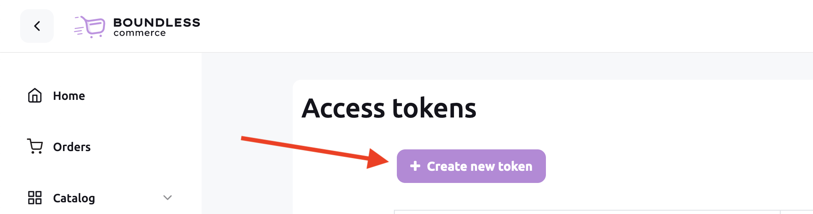
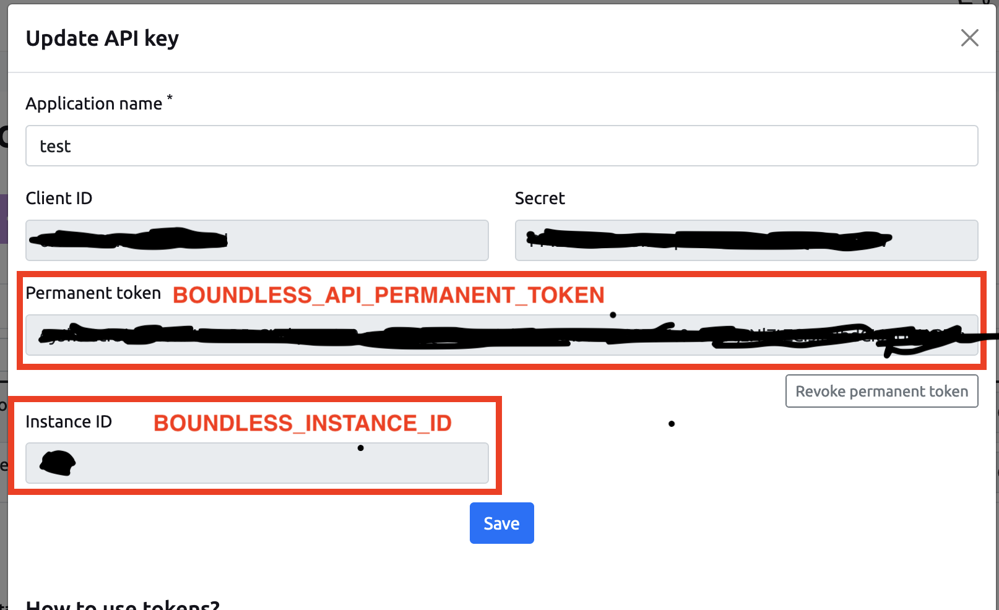

# Next.js E-Commerce template

Ready to use [Next.js](https://nextjs.org) (TypeScript) starter kit for high-performance 
e-commerce websites 🔥.

Free 👍. Ready to use 😎. Just clone & deploy! 🤘

## Online Demo ⚡️

[blank.demos.my-boundless.app](https://ecommerce-stunning.vercel.app/) - deployed to Vercel.

## About Boundless Commerce

[Boundless-commerce.com](https://boundless-commerce.com/) - API’s First Headless E-commerce CMS: We Provide An 
Admin-Side For Store Management, Powerful API, And Ready-To-Use Checkout Area.

## Getting Started

1. Go to [Boundless-commerce.com](https://boundless-commerce.com/) and create a free account (no credit card required).
2. Go to "Control panel" -> "Settings" -> "Access tokens" and create a new one: 

3. Copy `.env.example` to `.env`
4. Modify `.env`: put values for the `BOUNDLESS_API_PERMANENT_TOKEN` and `BOUNDLESS_INSTANCE_ID`, copy values from:

5. Install dependencies: `yarn install`
6. `yarn dev` - to start locally, then open `http://localhost:3000`
7. If you want to have absolute URLs in the sitemap.xml and OpenGraph meta tags 
you need to also specify `BOUNDLESS_BASE_URL`.

### Optional parameters

- `BOUNDLESS_BASE_URL` - Base URL if you want to have absolute 
URLs in the sitemap.xml and OpenGraph meta tags.
- `BOUNDLESS_PRODUCTS_IMAGE_PROPORTION` - Specify resize proportion so product images in lists have 
the same size. Possible values are: `1-1`, `2-3`, `3-2`,`4-5`, `5-4`, `3-4`, `4-3`, `16-9`, `9-16`.

## What is included?

Fully ready E-Commerce website with a hierarchical catalog, product widgets, 
filters, and marketing components like sliders and carousels.

We developed the template keeping SEO in mind: schema markup, sitemap, and 
all necessary meta-tags.

Shopping cart with a nice animated widget and [Fully customizable React checkout](https://github.com/kirill-zhirnov/boundless-checkout-react).

User friendly mobile version.

## Image Sample.

 

 

 

 

## Tech Stack Used.
<ul>
	<li>HTML</li>
	<li>CSS</li>
	<li>JAVASCRIPT</li>
	<li>TYPESCRIPT</li>
	<li>REDUX</li>
	<li>NEXT JS</li>
</ul>
[NextJS eCommerce templates](https://boundless-commerce.com/templates) - Free. Ready to use. Just clone & deploy!
